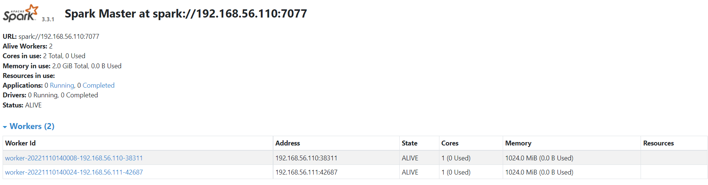
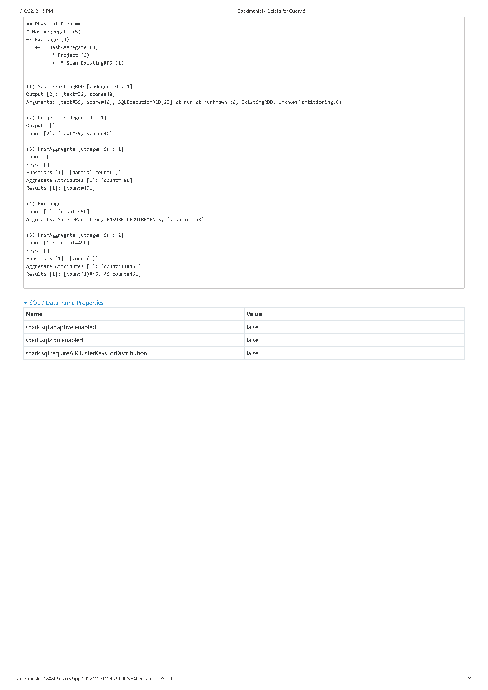

# Sparkimental

`A distributed sentimental analysis pipeline with PySpark`

 

## Description

> In this project, we will use a pre-trained sentimental analysis model and deploy its prediction pipeline on to a distributed Spark cluster simulated with VirtualBox VMs

### Aim

1. Setup and test a sentimental analysis **prediction** pipeline
    - **Note:** _prediction only not training_
2. Deploy on a spark cluster running on VMs (for realistic simulation purposes)
3. Testing with `animal-crossing` review dataset
4. Gather and review dataset/results with some analysis, visualizations.

### Technology

- `VirtualBox`, `Linux`
- `Anaconda`, `Python`
- `Java`, `Scala`
- `Spark`, `PySpark`
- `JupyterNotebook`

### Model

🚧 Add more details

`VADER` from `nltk` toolkit ([Link](https://www.nltk.org/_modules/nltk/sentiment/vader.html))

### Data

🚧 Add more details

Animal Crossing Reviews
 [Ref](https://www.kaggle.com/datasets/jessemostipak/animal-crossing)

🚧 EDA can be found ... (link the file)

## Environment

Our experiments are done on Linux VMs running on VirtualBox. Very detailed explanation on how to setup the environment is available in our doc. ([How to setup spark cluster on VMs](docs/spark-cluster-setup.md))

## Experiment Details

1. Spark Cluster (`VirtualBox`)
    - 1 master node: `spark-master`
    - 2 slaves: `spark-master` and `spark-slave-1`

2. Pipeline description
    - A data streaming server: simulated with `stream-server.py` which opens a socket at port `9999` and sends messages to any clients that connect to it
    - Spark Master: Connect to the streaming server at socket using `SparkStreaming` and distribute received data in batches to all workers for processing.
    - Spark Workers: Each have an instance of our model, process each batch of messages to generate sentimental score
    - Result Merging: After prediction, results are saved into the database (_here we simulate that by making workers send their predictions back to master for storing in a `.csv` file_)
3. How to recreate? 🤿
   1. Setup VMs and environment similar to our [environment](#environment) section
   2. Go to `spark-master` and start the cluster with `start-all.sh`
   3. (Optional) Pickle the model with `model-pickle.py`
   4. Run the streaming server

        ```[bash]
            python stream-server.py
        ```

   5. Run spark job to get data from socket and predict in batches

        ```[bash]
            spark-submit spark-stream-model.py

            # use this if want to output to log file
            spark-submit ... > ./logs/log-file.log
        ```

   6. Observe results and draw your own conclusions from
        - Spark web-ui (`spark-master:8080`)
        - Spark history server (`spark-master:18080`)
        - `./data/model-output.csv`
        - `console` or `log` (an example log is included in `./logs/`)

## Results

### Spark Results

1. Look at our [sample log](logs/spark-stream-model.sample.log) and [sample output](data/model-output.sample.csv) for more insights
2. Spark cluster specs
   
3. Event timeline of the cluster executing `spark-stream-model.py`
   
4. Details for execution of the #1 data frame `(batch 1 size 58 - query 5)`
    <p float="middle">
    
    
    </p>

    > The above query is related to Job 5 (which info could be found [here](docs/images/readme/job5info.pdf))

### Output Visualizations

🚧 To be finished: **Visuals of result**

## Docs

Documents included in this projects are:

- How to setup spark cluster on VMs (❗Our main testing environment for this project)
- How to setup Spark on Windows (not used for experiment)

## Extra Notes

- Visit `/docs` - for all the documents relating to setting up spark, ...
- `/scripts` - script for various testing purposes
- `/windows` is for supporting tools needed to run spark on windows
- `/data` - our input data and output aggregated data
- `/models` - where we store our pickled models (binary) for distributed reuse at workers

## Acknowledgements

Original teammate includes [@phoenisbuster](https://github.com/phoenisbuster) and [@RedEvilBK](https://github.com/RedEvilBK)

## Contact
<!-- icons  -->
[2.1]: https://img.shields.io/badge/LinkedIn-0077B5?style=for-the-badge&logo=linkedin&logoColor=white
[3.1]: https://img.shields.io/badge/Medium-12100E?style=for-the-badge&logo=medium&logoColor=white
[4.1]: https://img.shields.io/badge/Twitter-1DA1F2?style=for-the-badge&logo=twitter&logoColor=white

<!-- links to your social media accounts -->
[2]: https://www.linkedin.com/in/produdez/
[3]: https://medium.com/@produde
[4]: https://twitter.com/_Produde_

Created by [@produdez](https://github.com/produdez) - feel free to contact me or follow my blog on medium ❤️!

[![alt text][2.1]][2]
[![alt text][3.1]][3]
[![alt text][4.1]][4]
